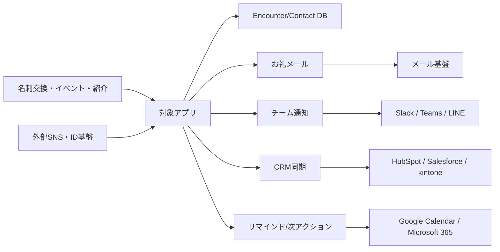

# 同一アプリのMarkdownファイル群を前提にした競合調査と差別化戦略報告

## エグゼクティブサマリ

アップロードされたMarkdown群から再構成すると、対象アプリは「名刺OCR」そのものよりも、**出会いの瞬間から初回フォローまでを最短で完了し、その文脈をチーム共有できる"CRM前"のレイヤー**に価値があります。現在の中核は、名刺撮影、OCR、文脈入力、重複検出、出会い履歴、チーム共有、ワンクリック級のお礼メール送信であり、完全なSFA/CRMではなく、**接点発生直後の速度・記憶保持・初動品質**に振り切った設計です。ファイル上でも明示的に「CRMを作らない。CRMの前を制する」と定義されており、後段のCRMへ"文脈付き"で渡す構想が中心にあります。fileciteturn0file1 fileciteturn0file2 fileciteturn0file0

競争環境は大きく三層です。第一に、**名刺管理の本流**である entity["company","Sansan","sales dx company"]、entity["company","Eight Team","business card sharing"]、entity["company","CamCard","business card software"]、entity["company","Wantedly People","business card app"]。第二に、**代替となるCRM/SFA**である entity["company","HubSpot","crm software company"]、entity["company","Salesforce","crm software company"]、entity["company","kintone","no-code work app"]、entity["company","Attio","crm platform"]。第三に、**隣接のデジタル名刺/イベント捕捉/関係管理**である entity["company","HiHello","digital business card"]、entity["company","Popl","event lead capture"]、entity["company","Dex","personal crm"] です。対象アプリが正面衝突を避けるべきなのは「企業全体の顧客マスタ」や「巨大CRMのワークフロー層」であり、逆に勝ちやすいのは**名刺交換直後の30秒UX、重複時の"再会"記録、チームへの文脈引き継ぎ、日本語フォロー文生成**です。citeturn18search4turn18search0turn20search1turn20search0turn18search8turn19search1turn21search0turn21search4turn24search8turn21search12turn23search1turn22search2turn22search1

外部連携の優先順位は明確です。最優先は、**CRM同期（HubSpot / kintone / Salesforce）**、**認証（Google / Microsoft / LINE）**、**社内通知（Slack / Teams）**、**予定化（Google Calendar / Microsoft Graph）**、**プロダクト分析（PostHog）**です。決済は現状の entity["company","Stripe","payments company"] 継続でよく、日本市場の補完として entity["company","PAY.JP","japan payments"] を監視対象に置く程度で足ります。逆に、XやInstagramの深い双方向連携は、獲得効率に対してAPI制約や運用コストが重く、初期は低優先が妥当です。citeturn16search0turn16search1turn34search0turn34search1turn35search0turn35search6turn13search0turn13search2turn27search0turn12search1turn27search10turn26search0turn26search1turn31search1turn14search0turn14search1turn14search2turn14search3turn29search1turn30search0

最大の実務リスクは、**市場ではなく実装の側**にもあります。ファイル群では名刺画像が公開バケットに置かれており、共有仕様も今後追加予定です。また、送信設定にユーザーごとのメールAPIキーを保持しています。法人利用の名刺データは日本の個人情報保護法の観点でも業務データベース化すると管理対象になり得るため、**非公開ストレージ化、署名付きURL、秘密情報の暗号化保管、外部データの出所管理**が必須です。さらに、SNSやWeb由来の外部テキストをAIに食わせると、プロンプトインジェクションやデータポイズニング的な影響を受けるため、**外部ソースを"システムの真実"にしない**設計が重要です。fileciteturn0file2 fileciteturn0file0 citeturn25search1turn17search0turn17search1turn17search2turn11search1turn11search2turn11search8

## 対象アプリの前提整理

この調査では、アプリの具体的な正式名称は**未指定**として扱うべきです。ただし、アップロードファイル内では「名刺メーラー」「MeishiAI」「meishi-mailer」という名称が混在しており、同一アプリの仕様・実装メモとして整合しています。現状機能として確認できるのは、名刺画像最大3枚の撮影、Claude VisionによるOCR、OCR結果からの日本語お礼メール下書き生成、SendGrid経由の送信、場所・イベント名・温度感・メモの保存、メールアドレス基準の重複検出、同一人物へのencounter追記、チーム招待、共有範囲設定、Free/Pro課金です。料金はFreeが月10スキャン、Proが月100スキャンで月額980円です。技術基盤はNext.js 14、Vercel、Supabase、Claude API、SendGrid、Stripeで構成されています。fileciteturn0file2 fileciteturn0file1 fileciteturn0file0

したがって、競合分析の前提となる中核価値は「名刺の精度」単体ではなく、**接点発生時の入力摩擦を極小化し、後で思い出せる文脈を残し、初回フォローを即座に打てること**です。とりわけ、重複した相手に対して新しいcontactを増やさずencounterを時系列追加する設計は、一般的な"連絡先テーブル"発想よりも**関係履歴グラフ**に近く、差別化の核になり得ます。一方、チーム内引き継ぎ、組織外共有、AI紹介メール、リマインド通知、AIアクション提案は未実装であり、ここが今後の勝負所です。fileciteturn0file1 fileciteturn0file0

同時に、現行実装には見逃せない設計上の示唆があります。名刺画像は公開バケット、重複時でも分析API実行後にスキャン数が加算される仕様、メールAPIキーがプロフィールテーブルに保持される仕様です。これは、セキュリティ・費用公平性・エンタープライズ導入適性の観点で改善余地が大きいことを意味します。短期勝ち筋は新機能を増やすことではなく、**個人情報保護・スキャン課金公平性・共有安全性を先に硬くすること**です。fileciteturn0file2 fileciteturn0file0 citeturn25search1turn25search5turn17search0turn17search2

## 競合地図と比較

競合は「直接競合」「代替競合」「隣接競合」に分けて見るべきです。直接競合は名刺管理や接点管理、代替競合はCRM/SFA、隣接競合はデジタル名刺、イベントリード取得、個人関係管理です。対象アプリにとって危険なのは、各カテゴリのプレイヤーが**一部機能だけで十分代替になり得る**ことです。たとえばHubSpotの無料名刺スキャナーは、接点を即CRM化したいチームには十分代替ですし、HiHelloやPoplはイベント現場の交換体験を奪います。citeturn40search0turn21search0turn23search15turn22search6

| 類型 | 競合 | 強み | 弱み | 価格・ビジネスモデル | 主なユーザー層 | 根拠 |
|---|---|---|---|---|---|---|
| 直接競合 | **entity["company","Sansan","sales dx company"]** | 名刺と営業履歴を全社共有し、APIやスキャナも含めて企業標準にしやすい | 見積制で導入が重く、全社運用前提になりやすい | 初期費用、運用支援費用、月額ライセンス、オプション、スキャナ月額の構成。価格は個別提案 | 中堅〜大企業の営業DX | citeturn18search4turn18search0turn20search1 |
| 直接競合 | **entity["company","Eight Team","business card sharing"]** | 中小企業向けに始めやすく、個人Eightの延長で社内共有しやすい | 基本APIが弱く、HubSpot/kintone連携は別オプション。30名未満推奨 | 基本19,800円/月、1人500円/月、10名まで無料。年間契約 | 30名未満中心の中小企業、既存Eight利用者 | citeturn20search0turn20search1turn20search3turn20search4turn20search5 |
| 直接競合 | **entity["company","CamCard","business card software"]** | 多言語認識、CRM同期、権限制御、AIノート、デジタル名刺まで広い | 10ユーザー以上のProfessional起点で、チーム利用はやや重い | Professionalは25ドル/ユーザー/月、10ユーザー以上。個人/チーム両対応 | 海外営業、国際展示会、分散チーム | citeturn18search8turn18search5turn18search1 |
| 直接競合 | **entity["company","Wantedly People","business card app"]** | 無料、10枚同時スキャン、Wantedlyプロフィール連動で個人利用が強い | チームワークフローやCRM連携の深さは限定的 | 無料アプリ起点。収益モデルの詳細は公開上未指定 | 個人のビジネスパーソン、人脈形成層 | citeturn19search1turn19search2turn19search5 |
| 代替競合 | **entity["company","HubSpot","crm software company"]** | 無料名刺スキャナー、CRM直結、シーケンスや自動化が豊富 | "出会い履歴"よりCRM contact起点。現場の文脈記録は主役ではない | 無料スキャナーあり、Sales HubはFree/Starter 15ドル/席〜 | SMB〜成長企業の営業/CS/マーケ | citeturn40search0turn40search6turn21search0turn40search1 |
| 代替競合 | **entity["company","Salesforce","crm software company"]** | 権限、オブジェクト、拡張性、Bulk APIまで企業運用に強い | 初期設計・運用が重く、接点直後のUXは相対的に弱い | Free 0、Starter 25ドル/人、Pro 100ドル/人など | 中堅〜大企業、複雑な営業プロセス | citeturn21search1turn21search4turn35search0turn35search6 |
| 代替競合 | **entity["company","kintone","no-code work app"]** | ノーコードで顧客管理アプリを自作でき、日本企業導入に強い | 名刺交換直後の専用UXはなく、設計は利用者側に委ねられる | 1,000円/1,800円/3,000円/ユーザー/月 | 日本の中小〜大企業、業務改善部門 | citeturn24search8turn21search2turn24search1turn34search2 |
| 隣接競合 | **entity["company","Attio","crm platform"]** | リアルタイム同期、自動データ拡張、Gmail/Outlook/Calendar連携が強い | 紙名刺起点ではなく、対面接点の即時記録に最適化されていない | Free、Plus 29〜36ドル/人/月 | モダンGTMチーム、創業〜成長期企業 | citeturn21search12turn24search5turn24search2turn24search14 |
| 隣接競合 | **entity["company","Dex","personal crm"]** | LinkedIn、メール、カレンダーから関係維持習慣を作れる | チーム共有や営業引き継ぎは弱く、個人CRM色が強い | Premium 12ドル/月 | 創業者、投資家、求職者、個人ネットワーカー | citeturn22search1turn24search6 |
| 隣接競合 | **entity["company","HiHello","digital business card"]** | デジタル名刺、Lead Capture、CRM連携、5〜100ユーザー導入が容易 | 紙名刺OCRより"デジタル交換"が中心で、再会履歴の深さは弱い | Business 5ドル/人/月、Enterprise別 | デジタル名刺を全社展開したいチーム | citeturn23search1turn23search15turn23search5turn23search17 |
| 隣接競合 | **entity["company","Popl","event lead capture"]** | イベント/展示会向けのバッジ読取、データ拡張、CRM同期に強い | イベント色が強く、日常的な関係管理や再会記録には寄りにくい | 見積制 | イベント集客/GTMチーム、展示会営業 | citeturn22search2turn22search3turn22search6 |

この比較から、対象アプリの最も有望な空白地帯は、**Eight Teamよりも"文脈記録"が深く、Sansanよりも軽く、HubSpotよりも"出会い直後UX"に強く、HiHello/Poplよりも紙名刺・再会・紹介に強い**ポジションです。要するに、「CRMでもデジタル名刺でもない、**営業・交流会・紹介ネットワークの初動OS**」として立つべきです。fileciteturn0file1 citeturn20search1turn18search4turn40search0turn23search15turn22search6

## 競合となりうる領域と参入障壁

直接の"名刺管理アプリ"だけでなく、ユーザーの仕事を代替する領域は五つあります。ここを見誤ると、目の前の競合表に載っていない相手にシェアを削られます。citeturn18search4turn21search0turn23search15turn22search6turn22search1

| 領域 | 代表例 | 競合化の仕方 | 参入障壁 | 本アプリの勝ち筋 |
|---|---|---|---|---|
| 名刺管理SaaS | Sansan / Eight Team / CamCard citeturn18search4turn20search0turn18search8 | 名刺をデータ化し、社内共有して終わるだけでも代替になる | OCR精度、データクリーニング、権限設計、導入支援、既存名刺移行 | "名刺管理"でなく"接点後30秒の行動変化"で勝つ |
| CRM/SFA | HubSpot / Salesforce / kintone citeturn40search0turn21search4turn24search8 | contact作成とフォロー自動化で十分な顧客接点管理になる | 既存ワークフロー、カスタムオブジェクト、管理者習熟、社内定着 | CRMを置き換えず、CRMに入る前の入力層になる |
| デジタル名刺・イベント捕捉 | HiHello / Popl citeturn23search15turn22search6 | QR/NFC/バッジ読取で"紙名刺不要"を実現される | デジタル交換体験、イベント運用、ブランド標準化 | 紙名刺・対面会話・再会文脈・紹介文生成を強みにする |
| 関係維持・Personal CRM | Attio / Dex citeturn24search5turn22search1 | メール・カレンダー・LinkedIn同期で"思い出し"を奪う | Inbox/Calendar/SNS連携、習慣化、通知品質 | 個人CRMではなく、チーム引き継ぎ・共有で差をつける |
| AI営業支援・会議メモ | HubSpot automation / CamCard AI Notetaker / Teams AI notes citeturn40search1turn18search8turn19search3 | 会話後の要約・次アクション提案が別ツールで完結する | 会議データ導線、精度、実行責任、チャネル接続 | "会議後"ではなく"名刺交換直後"から主導権を取る |

参入障壁の中で最も大きいのは、実は技術そのものより**スイッチングコスト**です。SalesforceやHubSpotはデータモデルとワークフローに埋め込まれ、Sansanは企業資産化のロジックに埋め込まれ、HiHelloやPoplは交換体験に埋め込まれます。対象アプリは、そこへ真正面から入るのではなく、**どの既存基盤にも前置できる"薄いが高頻度なレイヤー"**として位置付けるのが最も合理的です。citeturn18search4turn21search0turn21search4turn24search8turn23search15turn22search6

## API連携候補と技術評価

連携方針は、「深く結ぶ相手」と「浅く触るだけの相手」を分けるべきです。深く結ぶべきなのは、ログイン、CRM、予定、社内通知、分析、保存です。浅く触るだけでよいのは、SNS投稿や外部公開導線です。対象アプリは現状でもSupabase/Stripe/SendGridを採用しているため、まずは**既存スタックを活かしながら、CRM・認証・通知を足す**のが最短です。fileciteturn0file2 citeturn25search0turn14search0turn39search17

| カテゴリ | 連携候補 | 優先度 | 技術要件 | 効果 | 主リスク | 根拠 |
|---|---|---|---|---|---|---|
| 認証 | **entity["company","Supabase","backend platform"] + entity["company","Google","search and cloud company"] / entity["company","Microsoft","software company"] OIDC** | 最優先 | Supabase Social Login/SSO設定、Google Identity、Microsoft Entra OIDC | ログイン摩擦低減、法人SaaS導入が楽になる | テナント別SSO要件、ドメイン制御 | citeturn25search0turn25search2turn25search4turn13search0turn13search2 |
| 認証・国内流入 | **entity["company","LINE","messaging platform"] Login / LIFF** | 高 | LINE Login、メール権限申請、LIFF実装 | 日本での登録転換、LINE共有導線、友だち追加 | メール権限申請、LINE公式アカウント運用 | citeturn27search0turn27search4turn36search2turn36search7turn36search1 |
| CRM | HubSpot Contacts API + Webhooks | 最優先 | OAuth、contacts API、webhooks、レコード検索 | 「CRM前」ポジションを証明しやすい | UI/オブジェクト変更追随、重複マージ設計 | citeturn16search0turn16search1turn40search0 |
| CRM | kintone REST API | 最優先 | APIトークン認証、レコード追加/更新、項目マッピング | 日本のSMBに強い。Eight Team代替の有力導線 | 顧客ごとにアプリ構造が異なりやすい | citeturn34search0turn34search1turn24search8 |
| CRM | Salesforce REST / Bulk API | 高 | Connected App、OAuth 2.0、sObject/Bulk API | エンタープライズ導線、将来の大型案件対応 | 導入・検証負荷が高い | citeturn35search0turn35search1turn35search6turn35search19turn35search7 |
| 予定化 | Google Calendar / Microsoft Graph Calendar | 高 | OAuth同意、イベント作成API、双方向同期の設計 | リマインド・再接触予約・紹介設定が自然になる | カレンダー権限の心理的重さ | citeturn26search0turn26search1turn26search7 |
| 社内通知 | **entity["company","Slack","work chat platform"] / Microsoft Teams** | 高 | chat.postMessage、Events API、Graph chatMessage | チーム引き継ぎと即時共有に直結 | 通知スパム。Teamsはログ用途禁止 | citeturn12search1turn12search6turn27search6turn27search10 |
| 決済 | **entity["company","Stripe","payments company"] 継続** | 高 | Checkout、Customer Portal、webhook署名検証 | 現実装をそのまま活かせる | 決済失敗時UX、税務/請求運用 | citeturn14search0turn14search1turn14search2turn14search12 |
| 決済補完 | **entity["company","PAY.JP","japan payments"] 監視** | 中 | API移植、審査、国内決済オペ対応 | 日本向け手数料/審査面の補完余地 | 既存Stripeからの移行コスト | citeturn14search3turn14search11 |
| 分析 | **entity["company","PostHog","product analytics"]** | 高 | JS SDK、event taxonomy、PIIマスキング | 1M events無料枠でMVP計測しやすい | 個人情報の誤送信 | citeturn31search0turn31search1turn31search5 |
| 検索 | **entity["company","Algolia","hosted search"]** | 中 | インデックス設計、権限制御、非同期同期 | contacts / encounters / company横断検索が高速 | コスト増、誤インデックス時の漏えい | citeturn31search2turn15search0 |
| ストレージ | Supabase private bucket or **entity["company","Amazon Web Services","cloud provider"] S3** | 最優先 | private化、署名付きURL、ライフサイクル/削除設計 | 名刺画像の公開リスクを下げる | 移行作業、URL有効期限管理 | citeturn25search1turn31search3turn31search7 |
| メール | **entity["company","Twilio SendGrid","email platform"]** の運用整理 | 高 | Mail Send API、送信ドメイン認証、必要ならサブアカウント | 再送・クリック・配信失敗管理がしやすい | 現行のユーザー別APIキー保存は運用/セキュリティ負荷 | citeturn39search17turn32search0turn39search5turn39search9turn32search2 |
| SNS | **entity["company","LinkedIn","professional network"] Sign In / Share** | 中 | OIDC、w_member_social、審査/製品有効化 | 職業IDとして最重要、プロ向け獲得に効く | API製品アクセスの承認・範囲制限 | citeturn28search0turn28search3turn28search4turn28search20 |

推奨順位をはっきり言うと、**一番先に作るべき外部連携は HubSpot と kintone**です。理由は、ファイルが定義する「CRM前」ポジションと最も整合し、かつEight Teamの有料オプション領域と真正面で競争できるからです。Salesforceは案件単価は高い一方、初期には販売/導入コストが重く、後追いでも遅くありません。fileciteturn0file1 citeturn20search3turn20search4turn16search0turn34search0turn35search0

## 他SNSとの関係性と相互流入戦略

SNSは「投稿面」だけで見ると誤ります。対象アプリにとってのSNSは、**本人確認と職業アイデンティティ、連絡導線、イベント後の再接触、紹介の拡散**という四つの役割で見るべきです。特にB2B用途では、LinkedInは職業ID、LINEは日本の連絡チャネル、Slack/Teamsは社内拡散、Xはイベント実況、Instagram/FacebookはSMBや個人ブランド向けの補助線です。citeturn28search20turn27search0turn12search1turn29search3turn30search1turn30search0

| チャネル | 役割 | 推奨パターン | 制約・注意 | 相互流入の形 |
|---|---|---|---|---|
| LinkedIn | 職業アイデンティティ、信頼補完 | サインイン、プロフィール深掘り、共有ボタン、紹介文テンプレの下書き | 製品アクセス申請が必要。投稿はw_member_social前提 | イベント後の接点メモを整えて、本人がLinkedInで共有・つながる citeturn28search0turn28search3turn28search4 |
| LINE | 日本での再接触・通知 | LINE Login、友だち追加、LIFF共有、公式アカウントで再接触導線 | メール取得は申請制。Pushは公式アカウント運用が必要 | 名刺交換直後に「LINEでつながる」「紹介を送る」を作れる citeturn27search0turn36search2turn36search1turn27search13 |
| X | イベント実況、公開拡散 | 投稿用の共有リンク、イベントタグの自動付与支援 | APIは従量課金・アプリ審査。ノイズ比率が高い | 展示会後のまとめ投稿や参加報告から流入を拾う citeturn29search1turn29search0turn29search16 |
| Instagram / Facebook | SMB・個人ブランド・コミュニティ向け補助線 | コンテンツ公開、DM誘導リンク、ig.meなどの導線 | Instagram Messaging/APIはProfessional前提、Meta審査も重い | クリエイター/採用/イベント系セグメント向けに限定活用 citeturn30search1turn30search0turn30search3turn30search25 |
| Slack / Teams | 社内ソーシャルグラフ、引き継ぎ | 新規接点通知、再会通知、引き継ぎサマリー、リマインド | Teamsはログファイル用途禁止。人が読む通知だけ送るべき | 個人の接点をチームの接点に変える内部流入装置 citeturn12search1turn27search6turn27search10 |

データポイソニングとプロンプトインジェクションの観点では、**SNSデータは"本人が認証したID情報"までは比較的信頼できても、投稿本文・外部プロフィール説明・公開Web断片は低信頼**として扱うべきです。OWASPはPrompt Injectionを主要リスクに位置付け、Anthropicも外部コンテンツを処理するエージェントの防御を重要課題として扱っています。さらに、Social-Web由来の間接プロンプトインジェクションを扱う研究も出ています。したがって、SNSや外部Webから取り込むテキストは、**CRMへの自動書き込み・自動送信の根拠にしない**のが鉄則です。citeturn11search1turn11search2turn11search8

実装上は、第一に**ソース別の信頼度**を持たせるべきです。名刺OCR原本、ユーザー手入力、OAuthで取得したプロフィール、公開SNS投稿、外部スクレイピング結果は分けて保存し、`source_type`、`verified_at`、`confidence` を持たせます。第二に、AIへ渡す外部テキストは必ず区切り記法で囲み、命令として解釈させないようにします。第三に、外部ソース由来の会社名・肩書き・紹介文は、人間承認なしにCRM同期やメール送信に使わないようにします。名刺情報が業務で整理・活用されると個人情報データベース等に該当し得るため、取得目的と利用範囲の整理も必要です。citeturn17search0turn17search1turn17search2turn11search1turn11search5

## 差別化戦略と実行計画

差別化の基本方針は単純です。**短期は"速さと記憶保持"、中期は"文脈付き同期とチーム運用"、長期は"紹介と関係資産化"**です。つまり、最初からCRM本体や大型デジタル名刺基盤を作るのではなく、最初の接点データを誰よりも早く、気持ちよく、正確に残すことに集中すべきです。fileciteturn0file1 fileciteturn0file0

まず短期では、**「スキャン→文脈追記→送信→共有」までを1分以内に終わらせるUX**を磨くべきです。このときの目玉は、重複時の新規作成ではなくencounter追記、follow-up送信の提案、次回接触の予約化です。ここで勝てば、Eight TeamやWantedly Peopleよりも"使った直後の効き目"が明確になります。中期では、CRM同期とチーム引き継ぎを強くし、HubSpotやkintoneの前段として定着させます。長期では、紹介メール、関係スコア、再会の再活性化、社外共有リンクなどを積み上げ、「人脈を資産化したい経営者」「チーム営業組織」というファイルのターゲットに深く刺さる関係OSへ進化させます。fileciteturn0file1 citeturn20search4turn20search3turn40search1

固定費の目安は、現行スタックをそのまま活かすなら、Vercel Pro 20ドル/月、Supabase Pro 25ドル/月、PostHogは1M eventsまで無料、Algoliaは無料開始可能、SendGrid Essentialsは19.95ドル/月からです。AIは変動要素が大きく、Claude Opus系は入力5ドル/MTok・出力25ドル/MTok、Sonnet系は入力3ドル/MTok・出力15ドル/MTokです。したがって、**コスト最適化の最重要施策はモデルルーティング**であり、OCR/構造化は廉価モデル、メール文面の高品質生成だけ上位モデルに寄せるのが定石です。決済手数料はStripe国内カード3.6%、PAY.JPは2.59%〜が公表されています。citeturn37search0turn37search7turn38search0turn31search5turn15search0turn39search5turn39search6turn37search16turn37search20turn37search22turn14search6turn14search3

| 時間軸 | 重点戦略 | 実行項目 | 主KPI | 想定コストレンジ |
|---|---|---|---|---|
| 短期 | 接点直後UXの圧勝 | private storage化、重複時の無料追記、リマインド、HubSpot/kintoneへの手動同期、検索/フィルタ、プロダクト分析 | スキャン完了率、24時間以内フォロー率、重複統合率、月次継続利用チーム率 | 小〜中。ベンダー費は数十ドル〜、総額は数万円/月規模から開始可能 |
| 中期 | 文脈付きCRM同期の標準化 | HubSpot/kintoneネイティブ同期、Slack/Teams通知、引き継ぎサマリー、管理者ダッシュボード | 同期利用率、チーム共有率、引き継ぎ完了率、2回目接触率 | 中。利用量次第で数十万円/月に到達し得る |
| 長期 | 関係資産化と紹介ネットワーク | 紹介メール、社外共有リンク、関係スコア、LLM補助の次アクション提案、LinkedIn/LINE拡散導線 | 紹介経由新規接点数、復活接点率、NRR、営業案件化率 | 中〜大。セキュリティ/SSO/サポートまで含めると大きく伸びる |

KPIは、一般的なMAUだけでは不十分です。対象アプリの強さは**関係が進んだか**で測るべきで、最低でも「24時間以内フォロー率」「encounterが2件目に到達したcontact比率」「チーム共有contact比率」「CRM同期成功率」「紹介経由の新規接点数」は見るべきです。さらに、重複時に"また名刺交換してしまった"体験がどれだけ減ったかも重要な差別化指標です。これらはファイル群のプロダクトコンセプトと完全に整合します。fileciteturn0file1 fileciteturn0file0

## MVP機能セットとAPI設計上の注意点

推奨MVPは、機能を足すよりも**現在の核を安全かつ再現性高く磨く**方向で定義するべきです。必須は、名刺撮影、OCR、文脈入力、重複検出、encounter追記、お礼メール下書き・送信、private/team共有、contacts検索、最低1つのCRM同期、最低1つの社内通知連携です。逆に、AI紹介メール、組織外共有リンク、深いSNS投稿自動化、複数CRMの完全双方向同期はMVP外で構いません。fileciteturn0file1 fileciteturn0file2

API設計では、まず**ContactとEncounterを分ける現在方針は正しい**です。Contactは識別子の集約、Encounterは時系列イベントとして不変に近い形で積むべきです。ここに加えて、外部連携用の `external_links` テーブルを設け、`provider`、`external_id`、`last_synced_at`、`sync_status` を持たせると、HubSpot/Salesforce/kintoneとの衝突解決が格段に楽になります。また、`POST /analyze`、`/contacts/save`、`/send`、`/billing/webhook` には idempotency key を付け、OCR再試行やwebhook再送でも二重登録しないようにするべきです。fileciteturn0file0 fileciteturn0file2 citeturn14search0turn16search1

次に、**public bucketのまま名刺画像を持つ設計はMVPでも避けるべき**です。private bucket + signed URLへ移行し、画像にはアップロード時スキャン、保存期限、削除ポリシーを付けるのが望ましいです。組織外共有を将来やる場合も、期限付きトークンを発行し、原本URLは絶対に直接出さない構成にすべきです。加えて、現在の「ユーザーごとSendGrid APIキー保存」は早期には動きますが、将来的には秘密情報管理の負債になります。少なくとも暗号化保管と監査ログ、理想的にはプラットフォーム側送信へ寄せる設計を検討すべきです。fileciteturn0file2 fileciteturn0file0 citeturn25search1turn25search5turn39search17turn32search0

最後に、SNSや外部プロフィールを使うなら、**外部データは"読む"が"決めない"**を原則にしてください。AIが外部ソースをもとに件名や紹介文を提案しても、送信判定やCRM確定反映は人間承認にします。特に関係性アプリでは、誤った肩書き・古い会社名・悪意ある文言が、ユーザー体験より先に信頼を壊します。MVPで最も重要なのは多機能化ではなく、**速い・思い出せる・間違えない・漏らさない**の四点です。citeturn11search1turn11search2turn17search0turn17search2

未確定事項としては、正式サービス名、現在の実運用ユーザー数、想定する主販売チャネル、B2C対B2Bの比率、将来的なモバイルネイティブ化方針はファイルからは特定できません。そのため、本報告では**"CRM前のB2B接点管理アプリ"**として分析し、未指定の点はその前提で保守的に扱いました。fileciteturn0file1 fileciteturn0file2
